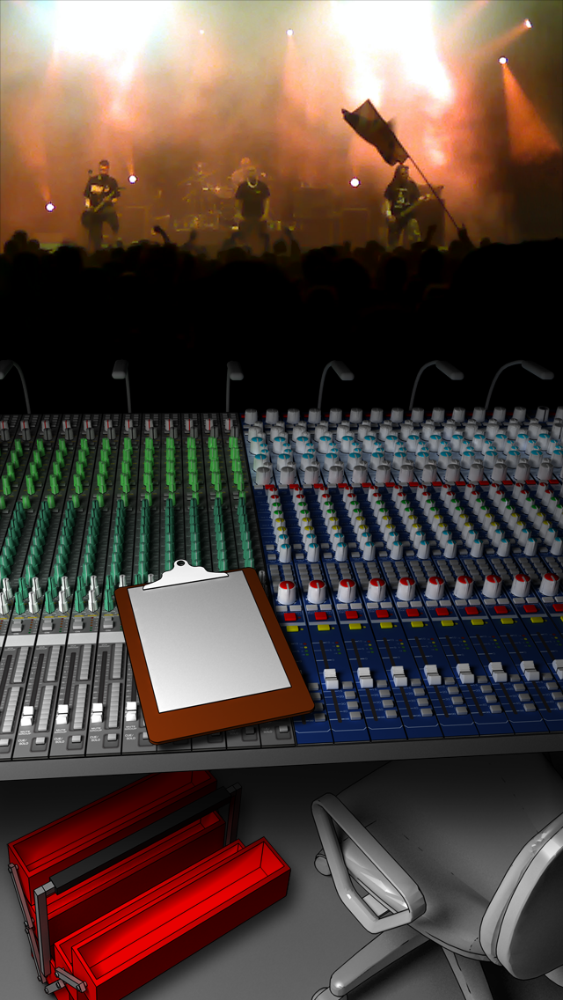
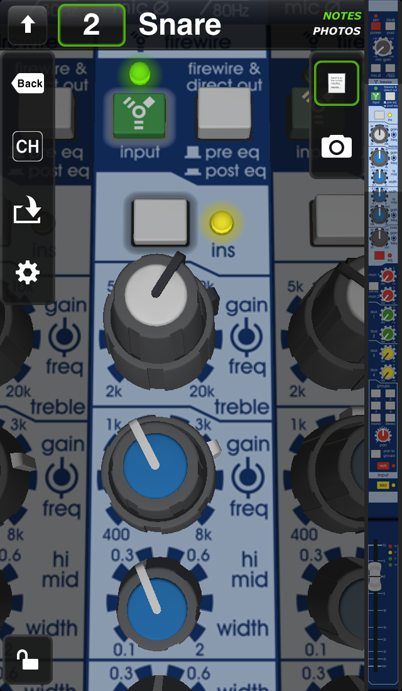
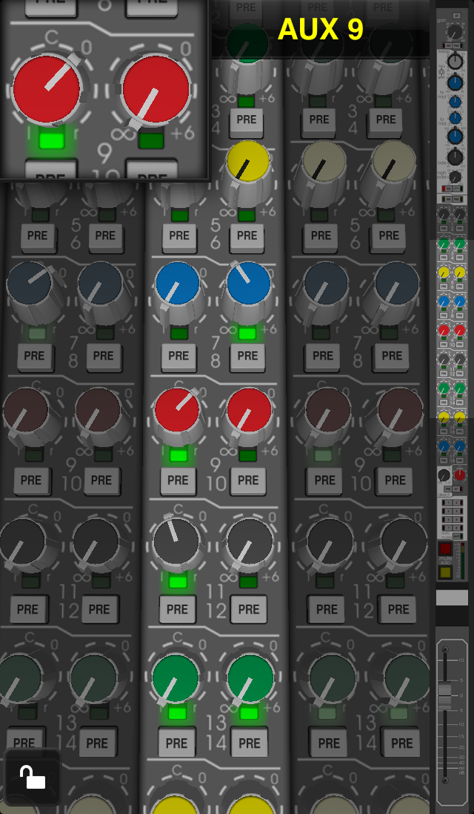
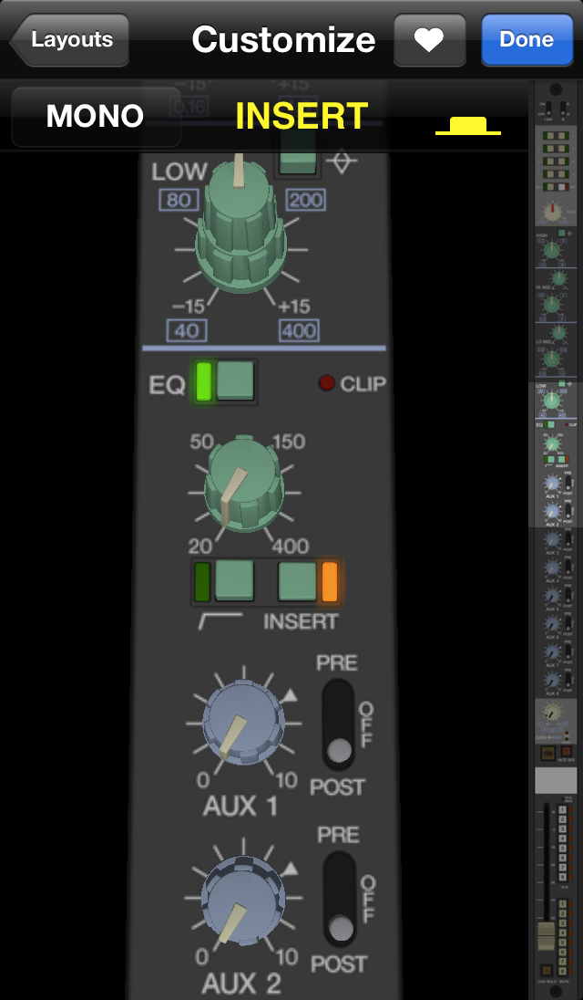

# FadeIn

   iOS app for sound engineers using analog equipment 

FadeIn is no longer available in the AppStore, since analog consoles themselves are rarely used these days. 
I've made the app available here (with the consent of all involved parties), as a novelty and to showcase my early work.

It has been updated to work on iOS 11/12, added Zoom, and Free Viewmode, fixed a few things, 
but did not redesign the app, or refactor the codebase.

## Screenshots
   

## Original description
FadeIn is designed for roadies and sound engineers who work with analog equipment, whether in studio or live.
It provides an effective solution for saving channel parameters and storing various notes in an organized, easy-to-navigate manner.

You no longer need to manage pages of cribsheets, or try to recall your parameters using photos, hoping you won't get lost in the process. FadeIn's informative interface and the fact that each piece of equipment is recreated in great detail ensures you will always know where you are and what to recall.

The fast and responsive controls allows you to quickly save any (or all) values after a soundcheck or studio session. You can also add notes and photos to each channel, storing outboard settings or whatever you may need. With these and various other features we aim to make the job of fellow sound engineers and roadies a bit easier.

#### Features
- responsive and informative interface
- quick and easy navigation
- equipment recreated with care, complete with all controls in 3D
- copy & paste between channels
- notes and photos for each channel
- lock & autolock to prevent accidental changes
- load values of existing scenes
- customizable default values for each console (per session)
- manage Session, Artist and Venue information
- customizable user interface & interaction
...

#### Consoles currently available
- Allen & Heath GL2400 / GL2800 / GL2800M / GL3800
- Midas Siena / Venice / VeniceF / Verona
- Midas XL250
- Soundcraft GB2 / GB4 / GB8
- Soundcraft MH2 / MH3
- Yamaha M2000
- Yamaha PM3000 / PM3500 / PM3500M
- Yamaha PM4000 / PM4000M

## Requirements
- Xcode 9.2+ to build
- iPhone5S+ running iOS 11+
- iPads are not supported directly (FadeIn was designed to be used with one hand)
